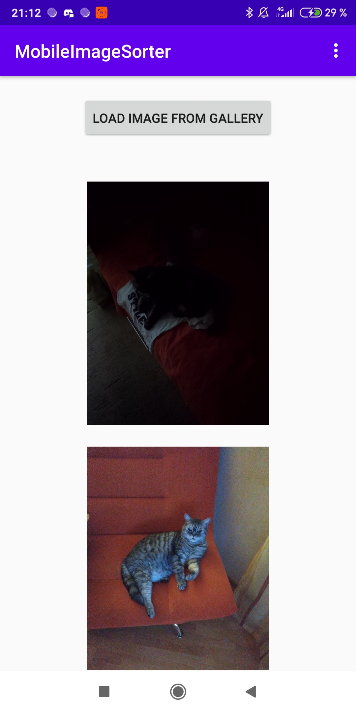
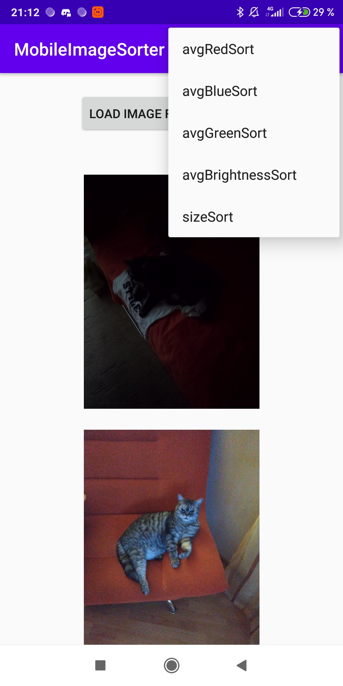

#ImageSorter

Скриншот мобильной версии.

После нажатия кнопки откроется галлерея и можно выбрать картинку для загрузки в приложение.
После загрузки из изображение обрабаытвается в отдельном потоке подготавливаясь к сортировке,
поэтому оно не будет отображаться сразу. В это время можно выбрать следующие картинки для 
загрузки и подготовки. После окончания загрузки изображение отображается в ленте под кнопкой.

Скриншот меню сортировок

avg(Red/Green/Blue)Sort-отсортировать изображения по средней интенсивности цвета
avgBrightnessSort-отсортировать изображения по яркости
sizeSort-отсортировать по размеру изображения

При выборе опции в меню изображения сортируются по выбранному признаку от 
меньшего к большему и отображаются в отсортированном порядке в ленте.

В репозитории исходный код приложения и собранный .apk файл.

Александр Абрамов 18ПИ1
